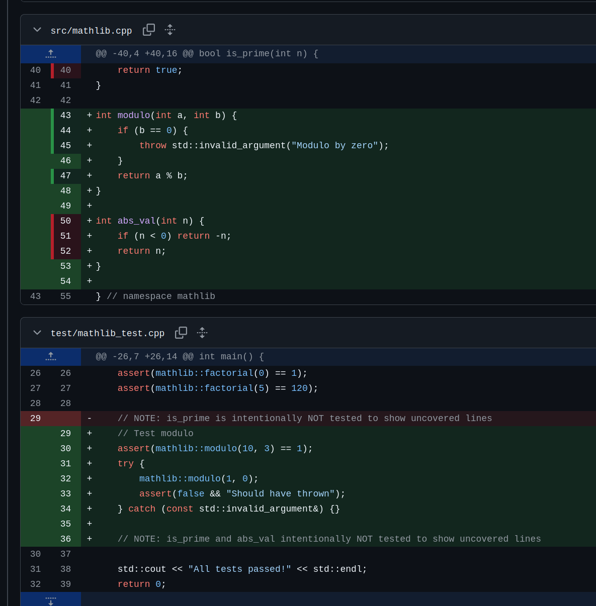

# Coverage Lens

> **Note:** This project was heavily vibe-coded. Expect bugs. Contributions and bug reports welcome.

Line-by-line code coverage overlay for GitHub Pull Requests — mimicking [GitLab's built-in coverage visualization](https://docs.gitlab.com/ee/ci/testing/test_coverage_visualization.html), but for GitHub.

 



## How It Works

1. Your CI runs tests and produces a **Cobertura XML** coverage report
2. CI uploads the report as a GitHub Actions **artifact** named `pr-coverage`
3. The browser extension detects PR diff pages, downloads the artifact, and overlays coverage indicators

**Green bar** = line is covered | **Red bar** = line is not covered | **No bar** = line is not instrumented

The extension is completely independent of your CI setup. It doesn't care how you generate coverage or what language you use — it only looks for a GitHub Actions artifact containing Cobertura XML.

## Quick Start

### 1. Add coverage upload to your CI

After your tests generate a Cobertura XML file, add this step to your workflow:

```yaml
- uses: actions/upload-artifact@v4
  with:
    name: pr-coverage
    path: path/to/your/coverage.xml
    retention-days: 7
```

That's it on the CI side. Every major test framework can produce Cobertura XML:

| Language | How to get Cobertura XML |
|----------|--------------------------|
| **C# / .NET** | `dotnet test --collect:"XPlat Code Coverage"` (Coverlet) |
| **Python** | `pytest --cov --cov-report=xml` |
| **JavaScript/TS** | `jest --coverage --coverageReporters=cobertura` |
| **Java** | JaCoCo with `jacoco:report` |
| **C/C++** | `gcov` + `lcov` + `lcov_cobertura` to convert |
| **Go** | `go test -coverprofile=c.out` + `gocover-cobertura` to convert |

See [docs/ci-examples/](docs/ci-examples/) for complete copy-paste workflow snippets per language.

### 2. Install the extension

**Firefox:** `about:debugging` > Load Temporary Add-on > select `packages/extension/manifest.json`

### 3. Configure

Click the extension icon and enter your **GitHub Personal Access Token** (classic token with `repo` scope). If your org uses SSO, authorize the token for that org.

Then navigate to any PR's "Files changed" tab. Coverage bars appear automatically.

## Multiple Test Jobs

If your CI has separate test jobs (e.g. unit tests, integration tests, different languages), you need to merge their coverage reports into a single artifact. Here's how:

1. Each test job uploads its own coverage artifact with a `coverage-` prefix
2. A final merge job downloads all of them and combines into one file
3. The merged file gets uploaded as `pr-coverage`

```yaml
jobs:
  unit-tests:
    steps:
      - run: pytest --cov --cov-report=xml
      - uses: actions/upload-artifact@v4
        with:
          name: coverage-unit
          path: coverage.xml
          retention-days: 1

  integration-tests:
    steps:
      - run: pytest --cov --cov-report=xml
      - uses: actions/upload-artifact@v4
        with:
          name: coverage-integration
          path: coverage.xml
          retention-days: 1

  merge-coverage:
    needs: [unit-tests, integration-tests]
    runs-on: ubuntu-latest
    steps:
      # Download all coverage-* artifacts into one directory
      - uses: actions/download-artifact@v4
        with:
          pattern: coverage-*
          path: coverage-parts
          merge-multiple: false

      # Merge XMLs with ReportGenerator (works for any Cobertura XML, not just .NET)
      - name: Install ReportGenerator
        run: |
          dotnet tool install -g dotnet-reportgenerator-globaltool
      - name: Merge coverage reports
        run: |
          reportgenerator \
            "-reports:coverage-parts/**/*.xml" \
            "-targetdir:merged" \
            "-reporttypes:Cobertura" \
            "-assemblyfilters:-*Test*"

      # Upload the merged result — this is what the extension reads
      - uses: actions/upload-artifact@v4
        with:
          name: pr-coverage
          path: merged/Cobertura.xml
          retention-days: 7
```

**How the merge works:** [ReportGenerator](https://github.com/danielpalme/ReportGenerator) is a .NET tool (but works with Cobertura XML from any language) that combines multiple coverage reports into one. It deduplicates file entries and merges line hit counts. If you only have one test job, you don't need any of this — just upload the XML directly.

There's also an optional [GitHub Action](packages/action/) included in this repo (`packages/action/`) that wraps the download-merge-upload pattern, but for most cases the explicit steps above are clearer.

## Limitations

- **Firefox only** — Chrome MV3 support not yet implemented
- **No GitHub Enterprise** — hardcoded to github.com (configurable GHE support is planned)
- **Artifact storage** — coverage XMLs are stored as GitHub Actions artifacts which count toward your repo's storage quota. Use short `retention-days` (7 or less) to avoid accumulation
- **No hit counts on hover** — GitLab shows how many times each line was hit; we only show covered/uncovered for now
- **Permissions are broad** — the extension currently requests `<all_urls>` (will be narrowed to github.com only)

## Future Plans

- **Hit count tooltips** — hover over a coverage bar to see how many times the line was executed (like GitLab), the data is already in the Cobertura XML
- **Chrome MV3 support** — service worker based background script
- **GitHub Enterprise support** — configurable API base URL
- **Narrower permissions** — restrict to github.com only
- **Published extension** — Firefox Add-ons / Chrome Web Store listing
- **Rate limit handling** — detect GitHub API 429s and retry with backoff

## Diagnostics

The extension has a built-in debug panel. Enable it from the popup settings to see what's happening:


## Project Structure

```
coverage-lens/
├── packages/
│   ├── extension/     Browser extension (Firefox MV2)
│   │   ├── lib/       Modular JS libraries (parser, API, cache, etc.)
│   │   ├── test/      Local test page + fixture XMLs
│   │   └── build.sh   Package for distribution
│   └── action/        Optional GitHub Action for multi-source merge
└── docs/
    ├── ci-examples/   Copy-paste CI configs per language
    └── images/        Screenshots
```

## Building

```bash
cd packages/extension
./build.sh firefox   # → dist/firefox/
```

Then load from `about:debugging` > Load Temporary Add-on > select `dist/firefox/manifest.json`.

## Development

Open `packages/extension/test/test-page.html` in a browser to test coverage rendering with mock data. You can drag-and-drop a Cobertura XML file onto the test page to verify the parser works with your coverage output.

## License

MIT
